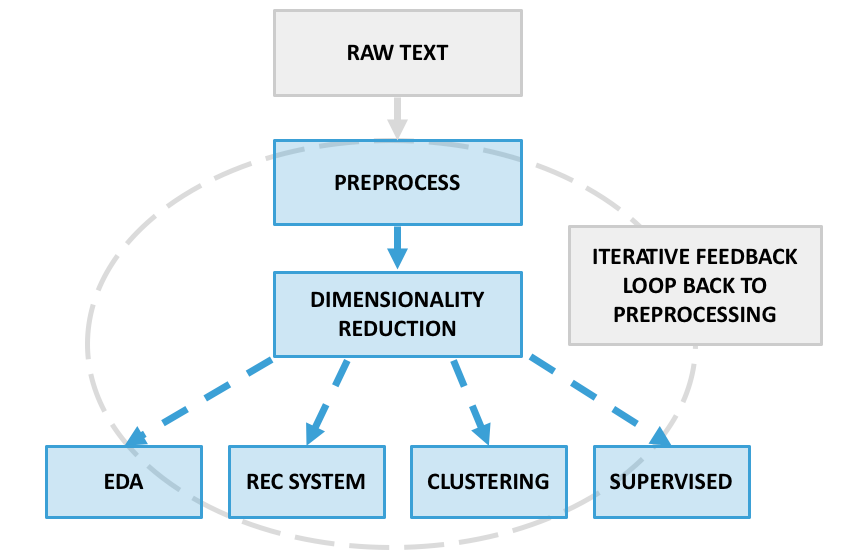

## Unsupervised Learning for NLP Project Workflow

This workflow should be viewed as a **helpful guiding framework** rather than an exact prescription of what to do and the order to do it in. Guidelines are helpful, but they must be combined with good judgment (enhanced through experience) in order to complete successful projects.

### How to build and test an unsupervised learning model for NLP

**1. Exploratory data analysis**

- **Look at and summarize the data**: Examine at least some documents in micro detail, checking that the data is correct and appears as you expected (e.g., the text should be formatted correctly and divided into documents as planned, should be complete and not cut off etc.). Also study the macro level by calculating some simple summary information such as the distribution of number of words across documents. Often you will have numerical and categorical data that supplements the raw text, and you can follow the standard EDA approach to look at summary information and statistics (what is the data type, how many entries and missing values are there, what are some descriptive statistics like mean for numerical columns, what is the count of documents per category, etc.). 

- **Identify cleaning/preprocessing priorities**: Close examination is extremely valuable in determining how your text data should be handled. While some cleaning steps like punctuation removal and lower casing are very standardized and usually included, different text datasets can present a wide range of issues that are more specific. These specific issues will usually surface as you dig into modeling results, but building an initial feel for them through inspection (and potentially even preempting them) is a good idea. Just a few examples are listed below:      
  - **Frequent spelling errors**: e.g. reddit/forum posts that are written casually might benefit from spelling correction algorithms 
  - **Domain-specific stopwords**: e.g. business or legal jargon words that differ from everyday usage can be included in a custom stopword list 
  - **Different languages**: e.g. tweets about US-China trade relations may be in multiple (and even mixed) languages. It may be easier to parse these by using translation and/or language recognition tools   
  - **Special characters**: e.g. a large quantity of emojis may need to be parsed with specialized tools  

**2. Preprocess the text data**

Converting raw text into a quantifiable, meaningful format is at the heart of NLP, and the details of this step have a major impact on all downstream modeling and analysis. Unsurprisingly (and as suggested by the visual diagram), this means that it's typical to **frequently return to and refine this step** as you build understanding and evidence in the modeling portion of the workflow. For example, inspecting topic model results may reveal that multiple spellings of the same important word are diluting other information, implying that these variations should be standardized to one spelling. Similarly, if certain words unhelpfully show up as major words in most topics, it can be very helpful to add these to your stopword list.    

The five following components are commonly, but not always, included in a preprocessing pipeline depending on the dataset and results. Note also that vectorization tools such as sklearn's [CountVectorizer](https://scikit-learn.org/stable/modules/generated/sklearn.feature_extraction.text.CountVectorizer.html) or [TfidfVectorizer](https://scikit-learn.org/stable/modules/generated/sklearn.feature_extraction.text.TfidfVectorizer.html) support both automatic and customized preprocessing when transforming raw text. For more detail on text processing refer to the [NLP overview](../nlp-overview) and/or [advanced NLP tools](../fancy-nlp). The [NLP pipeline pair](../../pairs/nlp_pipeline) may also be useful to reference. 

* **Clean**: remove punctuation and digits, convert to lower case

* **Tokenize**: split documents into lists of tokens, usually individual words or n-grams

* **Remove Stop Words**: exclude excessively common words that carry little signal, e.g. "it", "the", "and"

* **Stem/Lemmatize (optional)**: standardize words to their root form by either cutting off endings (stemming) or using morphological analysis (lemmatization), e.g. "running" -> "run"   

* **Vectorize**: convert documents to bag of words vector representation by counting their tokens, either with simple counting or frequency-weighted counting (tf-idf)

The end result of this step is typically a **document-term matrix** representation of the text data, i.e. a numerical format that can be passed as input to machine learning models including dimensionality reduction and topic modeling methods.

**3. Perform dimensionality reduction / topic modeling**

While document-term matrices are passed directly as input to final models in some applications (especially supervised learning), dimensionality reduction is often a critical step in unsupervised modeling. Sometimes, the dimensionality reduction is an aid to downstream modeling, like in clustering where working in very high dimensional spaces makes algorithms both much slower and less likely to find the broader grouping patterns that are useful for human interpretation. Other times, the reduction is a model end-goal in itself, such as in topic modeling: topics are reduced dimensions that can immediately be used to structure, interpret, and perform further analysis of your text data.  

The best choice of dimensionality reduction method naturally depends on how you want to use its output -- here are some example considerations based on the major models discussed in the course:

* **[PCA/SVD](../svd-pca)**: fast, simple to construct and tune, and effective at preserving (linear) information. *Difficult to interpret* reduced dimensions as "topics", because the "topic" coefficients applied to each word in the corpus vocabulary can be both positive and negative. Often a good choice for applications that aren't as focused on interpreting the new dimensions, such as clustering, recommendation systems, or downstream supervised learning.

Methods that are typically more appropriate to use for applications that focus on analyzing an interpretable **[topic model](../topic-modeling)** include:

* **NMF**: similar to PCA/SVD, though slower. *Easier to interpret* because topic coefficients are strictly non-negative. Often a strong choice when your documents are fairly short.  

* **LDA**: approaches topic modeling from a different, probabilistic paradigm that can effectively mirror the way humans tend to think about topics. Can be somewhat trickier to tune parameters. Often a strong choice when your documents are fairly long, e.g. newspaper article length. 

**4. Apply the results of dimensionality reduction / topic modeling**

This stage branches in multiple directions that depend on the application(s) you have in mind. Below are several possible major directions to go in:

A. **Further interpretation, exploration, and analysis**: interpret and summarize your topics by inspecting the words that define them / are most associated with them. What do the topics tell you about the overall structure of the data? How can you further explore the interaction between your topics and other facets of the data? For example, if you have a publication date for articles you can analyze how news topic share has changed over time; if you have the city for different real estate listings you can compare the way description themes change across geographies, grouping by city. You can think of this step as an extension of EDA that leverages your unsupervised modeling work, illuminating new findings and facilitating visualizations that can extract even more refined insight from your data. 

B. **[Recommendation system](../recommendation-systems)**: use your model from step 3 to create user and/or item profiles that form the basis for a recommendation system. For example, a user's reddit post history could be combined with a topic model to create a topic preference profile for that user. These profiles can be built into a nuanced, algorithmic system, with a simple approach such as the `get n most similar` algorithm providing a starting point.    
C. **Clustering**: extend dimensionality reduction to create an even more clearly defined structure for your data. The [K-means](../clustering-kmeans-lab) model assumes a fairly simple cluster structure and is a good starting point, with the best approach possibly ranging toward [more advanced techniques](../clustering-advanced) depending on the data structure. Note that while it's tempting to try clustering just for the sake of it, it may not be right for your application -- one important distinction to draw is that topic models represent documents as a mix of topics, while cluster models represent documents as a single final category. The former approach is likely more appropriate when trying to describe e.g. a newspaper article, but the latter approach would be more appropriate if trying to automatically categorize customer complaints into distinct buckets for ease of handling. Note also that clustering can naturally lead into branch A for final analysis.     

D. **Supervised learning**: use preprocessed, vectorized text (potentially with dimensionality reduction of the document-term matrix) as numerical feature input into a predictive model. Remember that when working on a predictive problem, it's always important to follow the usual best practices for establishing a robust validation and testing scheme, using validation to make iterative improvements to the model. In this case, validation performance can directly help you tune your preprocessing (step 2) and dimensionality reduction (step 3) choices in addition to your supervised model hyperparameter choices.    

---

**How to evaluate unsupervised modeling results?**

Evaluation is arguably one of the most challenging (and frustrating!) aspects of unsupervised learning. If you don't have labeled answers/a supervised component of the problem, how can you tell if your model is working "well"? What does it mean to "test" an unsupervised model? There are multiple angles to approach evaluation from, here are several that are worth considering in an unsupervised project:  

* **Quantifiable measurements**: there are numerical scores for the coherence of topics (document perplexity) or clusters (inertia, silhouette scores) that are useful for their objectivity, though not always related closely enough to a human perspective on topics or clusters to be useful. These can be helpful guiding tools for choosing model parameters, and can also be used to measure an out-of-sample application of the model (see immediately below) as a test of consistency.   

* **Generalizability**: as in supervised learning, we can use held out datasets to ask the question: how well does my model generalize to unseen documents that it wasn't trained on? This can be viewed more subjectively (e.g. by inspecting the results manually) or objectively (e.g. by calculating numerical coherence metrics and seeing how much they deviate between training data and holdout data).

* **Subjective inspection**: topic and cluster models are often applied to make it easier for humans to structure data in a useful way, and that usefulness then becomes the real end goal instead of a numerically "best" model. To that end, your subjective determination (or that of subject matter experts) of how sensible and applicable your results are can be the single most useful way to gauge model success. The model is successful if its results provide meaningful structure for further analysis or simplifying organization of your data. For example, the right number of topics in an LDA model might be determined by interpreting topic results (i.e. reading the strongest topic words to get a feel for what the topic is capturing) and deciding whether they are overly general (should use more topics) or overly specific (should use fewer topics).     

* **End-user feedback**: especially if you're building a recommendation system, the final verdict on model success will always be whether its intended beneficiary actually benefits! For example, if you're recommending new books to book readers, do they actually enjoy the books you recommended? Do they enjoy them more than randomly chosen books? Does your automatic customer complaint tagging system actually save the customer service team time? This type of feedback may be unrealistic for the scope of a short Metis project, but can be absolutely vital in real-world applications of unsupervised methods.  

Here are a few related additional resources:

* [Evaluating the topics generated by LDA](https://www.quora.com/What-are-good-ways-of-evaluating-the-topics-generated-by-running-LDA-on-a-corpus) (Brian Feeny's answer)
* [Pygotham topic modeling presentation by Christine Doig](http://chdoig.github.io/pygotham-topic-modeling/#/)
* [Strategies for evaluating cluster quality](https://stats.stackexchange.com/questions/195456/how-to-select-a-clustering-method-how-to-validate-a-cluster-solution-to-warran)
* [Sklearn cluster performance evaluation](http://scikit-learn.org/stable/modules/clustering.html)

---

**Other considerations and subtleties**

 There are many complex choices and tradeoffs that go into model design, and the above framework makes some assumptions including reasonably small data. In real world projects, some considerations that may impact/change the steps above include:

* **Data scale**: with larger data sets (e.g. 10 million+ documents), it's typically more practical to perform exploration, preprocessing, and initial modeling on a representative subset of the data rather than all of it. This is less resource (RAM) intensive and less time consuming, so will almost always be best practice.

* **Model scalability, speed, and maintainability**: when models are deployed as part of a live application (e.g. recommendation systems are often used this way), it can be critical that they run quickly and are easy to recurrently update. This can place limitations on the scope of model complexity, the dimensionality of the text features used and how much dimensionality reduction is applied, etc. This can have a big impact on the model choices made in steps 2-4 and also add an application/engineering performance testing element to your evaluation methods.
     

